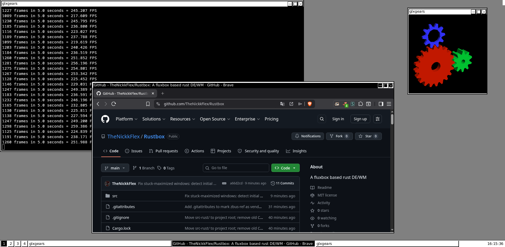
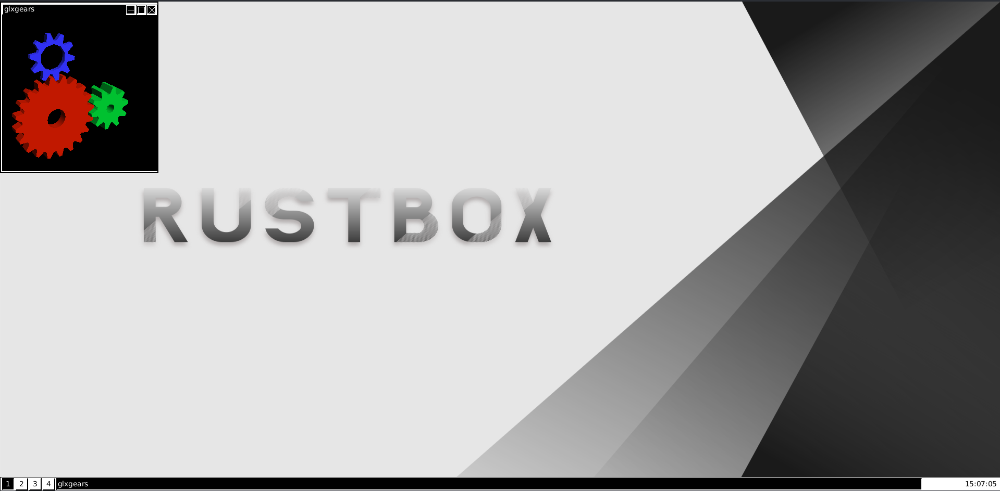

# Rustbox

A fluxbox-based window manager written entirely in **Rust** (X11).


## Beta Preview - *No Wallpaper Mode (Less Resource Usage, More About In Compile-time features)*




## Beta Preview - *Wallpaper Mode (More Resource Usage, More About In Compile-time features)*



## What is Rustbox?

Rustbox is a **pure-Rust, X11 window manager** that replaces the original
fluxbox C++ codebase piece by piece. It manages windows, workspaces, a
toolbar, a slit for dock apps, and a system tray — plus a built-in,
dunst-compatible notification daemon so you don't need a separate daemon
running.

- **No autotools, no make, no gcc.** Just `cargo build`.
- **No cairo, no pango.** Text is rendered with `fontdb` + `ab_glyph`
  (anti-aliased TrueType) plus emoji support (`skrifa` / `ttf-parser`).
- **EWMH-compliant.** Clients like kitty, alacritty, and Firefox get
  proper `_NET_WORKAREA` and `_NET_SUPPORTED` hints.
- **Built-in notifications.** `org.freedesktop.Notifications` + dunstctl,
  rules, markup, icons, progress bars, stack tags — all inside the WM.

## Resource usage

Measured **idle** (no managed windows) on a nested X server (Xephyr
1920×1080) with the release build. Two binaries were compared: the default
build (**with** the `wallpaper` feature) and the `--no-default-features`
build (**without** it). RAM is the WM process RSS; VRAM is the X server's RSS
(all server-side resources — windows, pixmaps, GCs — live in the X server, not
in the WM).

### No Wallpaper mode

Compiled with `--no-default-features --features "xrender xinerama xrandr xshape"`.
The root background is the default gray; no PNG is decoded or scaled.

| Resource        | Average (idle) | Notes                                                                                  |
|-----------------|----------------|----------------------------------------------------------------------------------------|
| RAM (WM RSS)    | ~61.6 MB       | Dominated by the font DB + emoji font loaded at startup. Stable over time.             |
| RAM (Xephyr RSS)| ~60.7 MB       | Server-side footprint: root + toolbar + tray windows and GCs (no wallpaper pixmap).    |
| CPU             | ~0.6 %         | Event loop blocks while idle; essentially idle.                                        |
| WM VmSize       | ~358 MB        | Virtual address space (includes mapped shared libraries).                              |

### Wallpaper mode (default)

Compiled with `--release` (default features, `wallpaper` enabled). The
wallpaper is an X11 server-side pixmap set as the root background; it adds a
one-time decode/scale cost at startup and again on every screen resize.

| Resource        | Average (idle) | Notes                                                                                                                      |
|-----------------|----------------|----------------------------------------------------------------------------------------------------------------------------|
| RAM (WM RSS)    | ~79.7 MB       | ~18 MB above the no-wallpaper figure (glibc heap left over from the one-time PNG decode+scale; **resolution-independent** — the displayed pixels live in the X server, not in the WM). |
| RAM (Xephyr RSS)| ~68.8 MB       | The extra ~8 MB over the no-wallpaper case is the root background pixmap (see below).                                     |
| CPU             | ~0.6 %         | Idle; the wallpaper is painted once (and again only on resize).                                                            |
| VRAM (root pixmap) | ~8.4 MB   | Root background pixmap at 1920×1080×4 ≈ 8.3 MB. Scales with resolution: ~3.1 MB at 1024×768, ~33 MB at 4K.                 |

The wallpaper background pixmap is a single 32-bit (4-byte) pixmap painted as
the root background, so its steady-state server-side cost is exactly
`width × height × 4 bytes`. The WM frees and re-creates it on each screen
resize/rotation, so it does **not** accumulate over time.

To reclaim the ~18 MB of WM RSS on constrained hardware, build **without** the
`wallpaper` feature (see Compile-time features) — you get the gray-background
WM at ~61.6 MB instead, with identical functionality otherwise.

> **Reproduce the numbers:** `./scripts/test-xephyr.sh` (wallpaper build) or
> `./scripts/test-xephyr.sh nowp` (no-wallpaper build) launches a nested Xephyr
> on `:5`; read `VmRSS` from `/proc/<rustbox-pid>/status` and from the Xephyr
> PID for the respective figures above.

## Features

| Area              | What's working                                              |
|-------------------|-------------------------------------------------------------|
| Window management | create, destroy, move, resize, focus, minimize, maximize, fullscreen, shade |
| Workspaces        | multiple virtual desktops with rename                       |
| Toolbar           | clock, workspace list, window taskbar                       |
| Slit              | dock-app container (Window Maker / bbtools style)           |
| System tray       | `_NET_SYSTEM_TRAY_S0` with overflow popup + chevron         |
| Root menu         | right-click menu with workspace navigation, run dialog      |
| Keybindings       | configurable via `~/.config/rustbox/keys`                   |
| RandR             | screen resize / multi-monitor reflow                        |
| EWMH              | `_NET_WORKAREA`, `_NET_SUPPORTED`, etc.                     |
| Notifications     | dunst-compatible, full-featured (see below)                 |
| Font system       | TrueType, anti-aliased, emoji, bitmap fallback              |
| D-Bus tray        | StatusNotifierItem (modern tray apps via `zbus` + `smol`)   |

### Notification daemon (built-in)

- **Interface**: `org.freedesktop.Notifications`
- **dunstctl**: `org.dunstproject.cmd0` (ping, pause/resume, close,
  closeAll, history, context, closeLast, clearHistory, removeFromHistory,
  popHistory, historyCount, configReload)
- **Rules**: regex-based (appname, summary, body, urgency, category,
  stack_tag, desktop_entry); override timeout/urgency/icon, skip_display,
  set_transient, history_ignore
- **Config**: dunstrc-like INI at `~/.config/rustbox/notifications.conf`
- **Markup**: `<b>`, `<i>`, `<u>`, `<a>`, `` stripping
- **Icons**: `image-path`, `image-data` (RGBA8), desktop-entry →
  theme icon lookup across freedesktop directories
- **Progress bar**: hint `value` rendered in the popup
- **Stack tags**: same-tag notifications replace each other in-place

## Building

Rustbox is a pure Rust project. You only need the Rust toolchain and the
X11 client libraries — **no gcc, make, autotools or C compiler are
required**.

### Prerequisites

- X11 development libraries
- Git (only to clone)

#### Install Rust

Pick either your system package manager or the official rustup installer:

**Via distro repositories (simplest):**

| Distro        | Command                             |
|---------------|--------------------------------------|
| Debian/Ubuntu | `sudo apt-get install rustc cargo`  |
| Arch Linux    | `sudo pacman -S rust`               |
| Fedora/RHEL   | `sudo dnf install rust cargo`       |
| Alpine        | `sudo apk add rust cargo`           |

**Via rustup (official, works everywhere):**

```bash
curl --proto '=https' --tlsv1.2 -sSf https://sh.rustup.rs | sh
```

Make sure `cargo` is on your `PATH` (`source "$HOME/.cargo/env"` or
log out/in).

#### Install X11 dev libraries

| Distro        | Command                                                                                                       |
|---------------|---------------------------------------------------------------------------------------------------------------|
| Debian/Ubuntu | `sudo apt-get install libx11-dev libxinerama-dev libxrandr-dev libxext-dev libxft-dev libxdamage-dev`          |
| Arch Linux    | `sudo pacman -S libx11 libxinerama libxrandr libxext libxft libxdamage`                                       |
| Fedora/RHEL   | `sudo dnf install libX11-devel libXinerama-devel libXrandr-devel libXext-devel libXft-devel libXdamage-devel`  |

### Build & install

```bash
git clone https://github.com/TheNickkFlex/Rustbox.git
cd Rustbox

# Debug build
cargo build

# Release build (Wallpaper Mode, See More Above in Compile-time features)
cargo build --release

# Install to ~/.cargo/bin (optional)
cargo install --path .
```

#### Compile-time features

Rustbox is built with Cargo features. The default set is
`xrender xinerama xrandr xshape wallpaper`.

The bundled **wallpaper** is compiled behind the `wallpaper` feature. On
extremely limited hardware you can build without it to skip the embedded image
and the decode/scale step at runtime (lowers resident memory by ~35 MB in
testing). Keep the other features enabled — they are required for the WM to
compile and run:

```bash
# Wallpaper enabled (default)
cargo build --release

# Wallpaper disabled — leanest runtime, gray background instead
cargo build --release --no-default-features \
  --features "xrender xinerama xrandr xshape"
```

> Note: the `image` crate stays linked regardless, because it is also used for
> tray icons, notifications and font rendering. Disabling `wallpaper` therefore
> reduces *runtime* memory, not the binary size.

## Running

Rustbox is a window manager — it replaces your current WM on a given X
display:

```bash
# From the build directory
./target/release/rustbox

# Or, if installed via cargo
rustbox
```

Rustbox uses `$DISPLAY` by default. You can override with `-display :1`.
The `-socket` flag also works for direct X socket paths.

The root menu launches **kitty** as the default terminal emulator. Make sure
it is installed.

### Testing inside a nested Xephyr

To try Rustbox without touching your real session, use the helper script.
It starts a nested Xephyr (on `:5` by default, using your current `$DISPLAY`
as the host) and launches Rustbox against it — no manual `DISPLAY` juggling
required:

```bash
# Wallpaper build (default)
./scripts/test-xephyr.sh

# No-wallpaper build
./scripts/test-xephyr.sh nowp

# Stop the test session
./scripts/test-xephyr.sh kill

# Inside the nested display, open a terminal:
DISPLAY=:5 kitty &
```

> Note: Xephyr must be able to find a host X server, so run the script from a
> normal X session (where `$DISPLAY` points at a real server such as `:0`).
> If you see `Xephyr cannot open host display`, your `$DISPLAY` is not set or
> points nowhere.

## Configuration

| File                                   | Purpose                                             |
|----------------------------------------|------------------------------------------------------|
| `~/.config/rustbox/keys`               | Keybindings                                         |
| `~/.config/rustbox/workspaces.conf`    | Workspace names                                     |
| `~/.config/rustbox/notifications.conf` | Notification rules and theming (dunstrc-like INI)    |

## Dependencies (Rust crates)

All Rust dependencies are fetched and pinned by Cargo — you never install
them manually.

- **X11**: [`x11rb`](https://crates.io/crates/x11rb) (pure-Rust protocol)
- **Fonts**: `fontdb` (discovery), `ab_glyph` (rasterization),
  `ttf-parser` / `skrifa` (emoji, COLRv1)
- **Images**: [`image`](https://crates.io/crates/image) crate (PNG, XPM, etc.)
- **D-Bus**: `zbus` + `smol` (single async connection serving both the
  notification daemon and the SNI tray)
- **Other**: `regex`, `serde`, `anyhow`, `env_logger`, `glob-match`, `libc`

## License

Rustbox is licensed under the MIT License. See [LICENSE](LICENSE) for details.

## Credits

- **[fluxbox](https://github.com/fluxbox/fluxbox)** — *Recreated in Rust*
- **[dunst](https://github.com/dunst-project/dunst)** — *Recreated in Rust*
- **[zbus](https://github.com/z-galaxy/zbus)** — *Made in Rust*
- **[wallpaper-base](https://www.magnific.com/free-vector/background-luxury-minimalist-gradient-style-design_32582903.htm#fromView=keyword&page=1&position=0&uuid=dd98b9e7-a54e-4904-87ae-492fee8f5aa9&query=Minimalist+black+white+wallpaper)** — *The Base For Rustbox Wallpaper*
